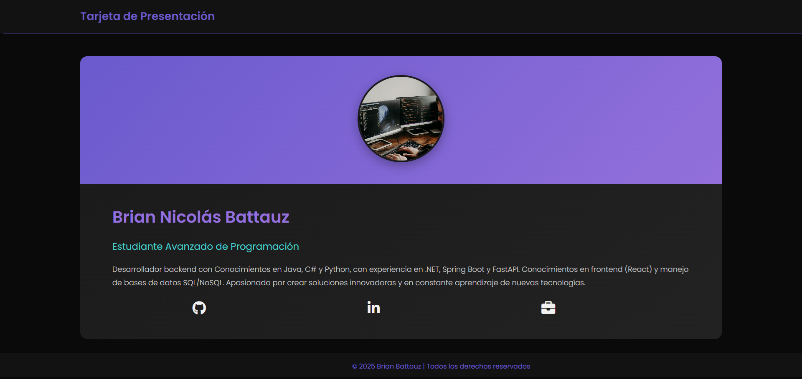

# Tarjeta de Presentación Personal



## 📋 Descripción
Tarjeta de presentación personal desarrollada con HTML y CSS puro, cumpliendo con los requisitos específicos de no utilizar Flexbox ni Grid.

## 🛠 Tecnologías utilizadas
- **HTML5** (estructura semántica)
- **CSS3** (estilos personalizados)
- **Git** (control de versiones)
- **GitHub Pages** (deploy automático)

## 🚀 Cómo visualizar el proyecto
1. **Online**: [Ver en GitHub Pages](https://Brian13b.github.io/tarjeta_presentacion/)
2. **Localmente**:
   ```bash
   git clone https://github.com/Brian13b/tarjeta_presentacion.git
   cd tarjeta_presentacion
   open index.html
